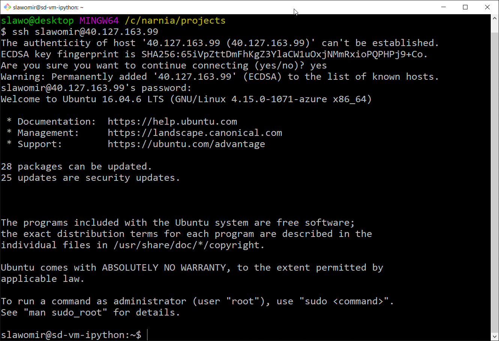

# Overview   
This is a simple script that will create a brand new VM with ubuntu with Docker, SSH and Samba configured in it. Should allow you to create a playground withing a couple of mimutes.

# Usage
* Azure Virtual Machine   
    Create VM in Azure, configure public static IP, SSH and Samba.
   * Prerequsite   
   `Install-Module -Name Az -AllowClobber`
   * Create VM   
   `.\azurevm\createvm.ps1`   
   `.\azurevm\createvm.ps1 -ResourceGroupName "rs-sd-ipython-sandbox"` 
   
   
   
   * Remove VM   
   `.\azurevm\createvm.ps1 -Remove $true`
   `.\azurevm\createvm.ps1 -ResourceGroupName "rs-sd-ipython-sandbox" -Remove $true`
   
* VirtualBox   
    Create VM in local VirtualBOX, configure SSH and Samba
    * Prerequisite:
      * Download Ubuntu image
      * Connect to Internet
      * Make sure you have a bridge network for Virtual Box
    * Create VM   
    `.\virtualbox\createvm.ps1`   
    
    
    
